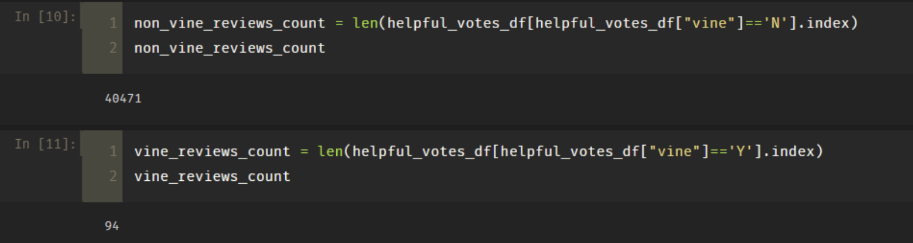
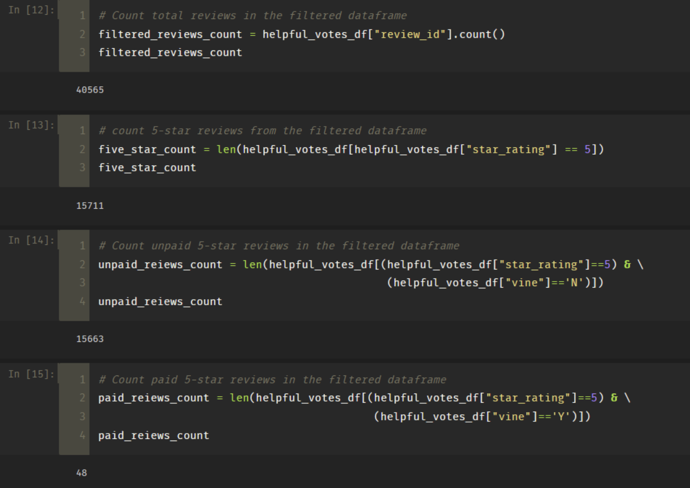
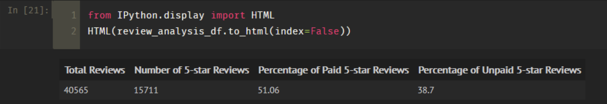
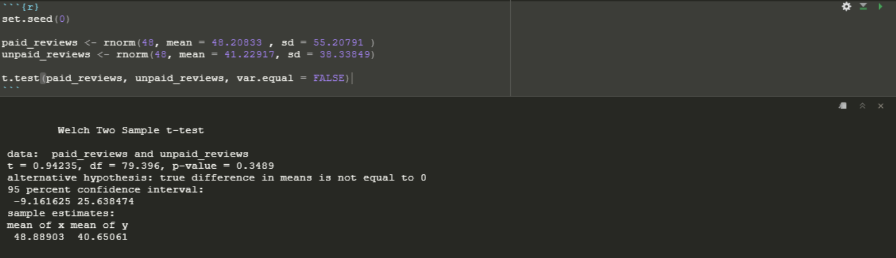

# Amazon_Vine_Analysis
## Overview
This project is about analyzing Amazon reviews written by members of the paid Amazon Vine program. The Amazon Vine program is a service that allows manufacturers and publishers to receive reviews for their products.
In this project, we will use PySpark to perform the ETL process to extract a video games dataset, transform the data, connect to an AWS RDS instance, and load the transformed data into pgAdmin. Next, we will use PySpark, Pandas, or SQL to determine if there is any bias toward favorable reviews from Vine members in the video games dataset.

#### Control Flow
1. Using PySpark extract the video games dataset from AWS S3 bucket
2. Transform the data
3. Connect to an AWS RDS instance, and load the transformed data into pgAdmin
4. Use PySpark, Pandas, or SQL to determine if there is any bias toward favorable reviews from Vine members in the video games dataset.

## Results: Review Classification
Our review classification was based on the following:
- video games with 20 or more votes
- ratio of helpful_votes to total_votes greater than 50%
- percentage classification is based on 5-Star reviews
#### Review Classification
- There are 94 vine reviews and 40471 non-vine reviews in the filtered dataset
- There are 15711 5-star reviews in the filtered dataset
- There are 48 5-star paid(vine) reviews and 15663 5-star unpaid(non-vine) reviews
- 51.06% of the paid reviews were 5-star reviews, while 38.70% of the unpaid reviews were 5-star reviews

### Summary
Of video games with 20 or more votes and where the ratio of helpful_votes to total_votes was 50% or greater, 51.06% of reviews in the vine program were 5 stars. While 38.70% of unpaid reviews in the same filetered dataset were 5 stars. On a high-level we may conclude that there is some bias toward favorable reviews from Vine members in the video game dataset.
###### Vine Review Analysis Summary

A better way to determine bias is to compare a random sample of paid reviews to a random sample of unpaid reviews in a t-test. In this test we would compare the average number of 5-star reviews in the paid reviews to the average number of 5-star reviews in the unpaid reviews.

Our Study design for this scenario would be as follows:

Since our study design seeks to determine if there is any positivity bias in the vine program (meaning are paid reviews generally more favorable than unpaid reviews), we would look to study metrics such as average 5-star review per sample.

1. Research Question
   - Are there differences in average 5-star review count between paid program and the unpaid program?
2. Forming Our Hypothesis
   - Null Hyothesis: The true difference in helpful_votes means between between the paid and the unpaid program is eqaul to 0
   - Alternative Hypothesis: The true difference in helpful_votes means between between the paid and the unpaid program is not eqaul to 0
3. Statistical Test
   - Since we are dealing with dichotomous data, (sample A vs Sample B), and our dependent variable (average 5-star ratings helpful_votes count) is continous, we would employ the Two-sample t-test to evaluate if there are differences in number of 5-star ratings helpful_votes count between paid reviews and unpaid reviews
4. Data Requirement
   - Sample A: sufficiently large paid sample reviews dataset 
   - Sample B: sufficiently large unpaid sample reviews dataset

##### Two-Sample T-Test Summary

In these results, the null hypothesis states that the difference in the mean helpful_votes between the paid and unpaid 5-star reviews is 0. Because the p-value is 0.3489, which is higher than the significance level of 0.05, the decision is to accept the null hypothesis and conclude that the mean helpful_votes of 5-star reviews of the paid and unpaid reviews are similar and we say there is no positivity bias in the vine program
