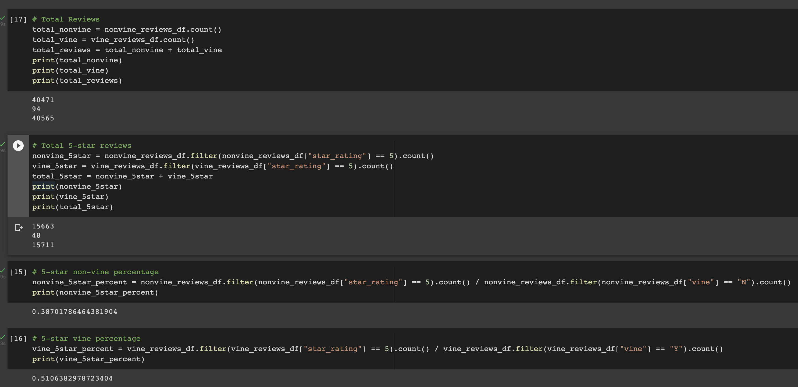

# 16Amazon_Vine_Analysis

## Overview & Purpose
I was tasked with the responsibility of using AWS, PostgreSQL, and pyspark in order to figure out if paid (Vine) reviews showed bias towards the videogames they were reviewing by comparing the percentage of 5 star reviews that were a result of both paid and unpaid reviews.

## Results
As you can see in the screenshot below, there were 40,471 unpaid reviews vs. 94 paid reviews. Of these reviews, there were 15,663 unpaid 5-star reviews and 48 5-star paid reviews meaning that 39% of the unpaid reviews were rated with 5 stars and 51% of the paid reviews were rated with 5 stars.

## Summary
With these results, I would conclude that with videogames, paid reviewers tend to show positivity bias seeing that there is a 12% difference between the two groups which is pretty significant.

Another analysis I believe I couldve performed on this dataset is looking into how average a 5_star rating is within each group. If I were to do this I believe that it further prove my findings that paid reviewers show positivity bias when reviewing videogames.
